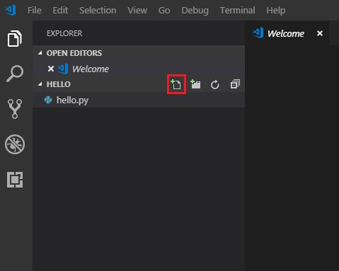
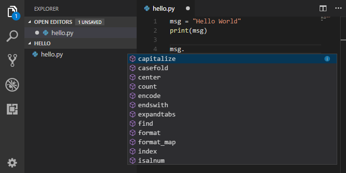
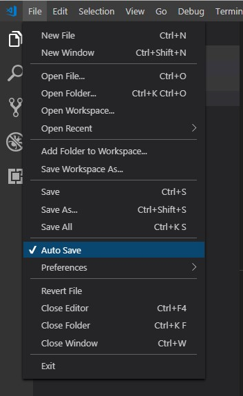
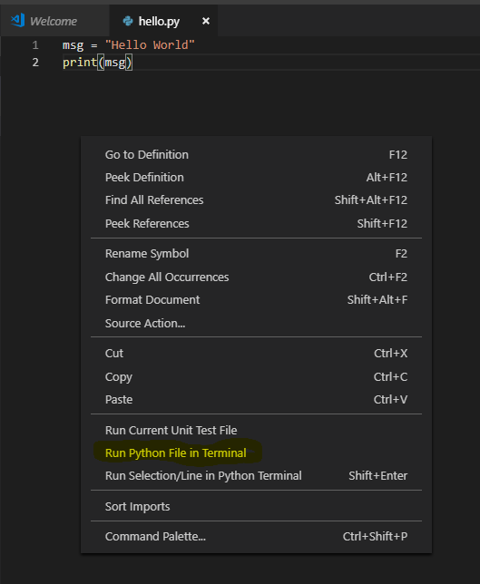
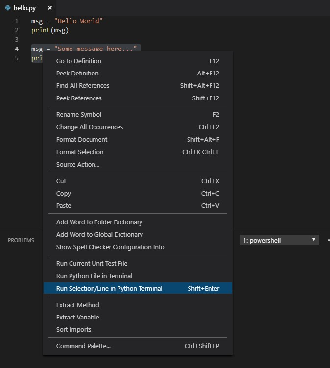
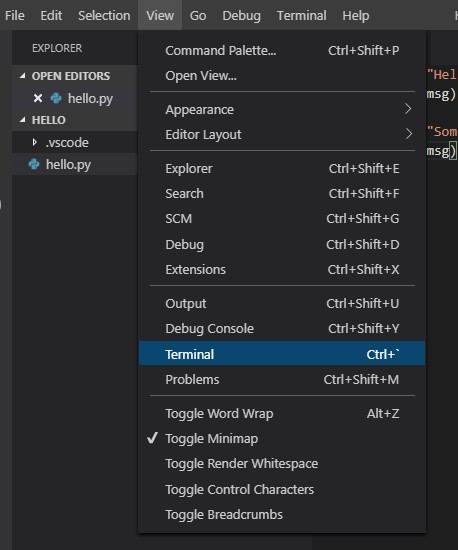

# Run Python Code with VSCode

## Step-1: Create a Project Directry

Using your system's file manager, create a directory to store project files.

And from VSCode 

* Select 'open folder'
* And select the the folder you just created


## Step-2: Create a Python file `hello.py`

From the `File Explorer` toolbar, click the `New File` button on the hello folder:




Name the file `hello.py`, and it automatically opens in the editor:

## Step-3: Start typing Python code

```python
msg = "Hello World"
print(msg)
```

When you start typing print, notice how `IntelliSense` presents auto-completion options.


Type msg.:




Save the file (Ctrl+S).

* Or checked **File > Auto Save** from menu to auto save changes.




## Step-4: Select a Python interpreter

Python is an interpreted language, and in order to run Python code and get Python IntelliSense, you must tell VS Code which interpreter to use.

* From within VS Code, select a Python 3 interpreter by opening the **Command Palette (Ctrl+Shift+P)**, start typing the **Python: Select Interpreter** command to search, then select the command.


* You can also use the **Select Python Environment** option on the Status Bar if available (it may already show a selected interpreter, too)


## Step-5: Enable linters

Linting highlights syntactical and stylistic problems in your Python source code, which oftentimes helps you identify and correct subtle programming errors or unconventional coding practices that can lead to errors.

To enable linters other than the default PyLint, open the Command Palette (Ctrl+Shift+P) and select the Python: Select Linter command. This command adds `"python.linting<linter>Enabled": true` to your settings, where `<linter>` is the name of the chosen linter. See Specific linters for details. 
    


Enabling a linter prompts you to install the required packages in your selected environment for the chosen linter.
    


## Step-6: Run the Python program

It's simple to run hello.py with Python. Right-click in the editor and select Run Python File in Terminal (which saves the file automatically):



The command opens a terminal panel in which your Python interpreter is automatically activated


There are two other ways you can run Python within VS Code

* Select one or more lines, then press Shift+Enter or right-click and select Run Selection/Line in Python Terminal. This command is convenient for testing just a part of a file.



*  Open terminal from **View > Terminal** menu. (Keyboard shortcut: Ctrl + ~)



* In terminal type this

```bash
python hello.py
```


